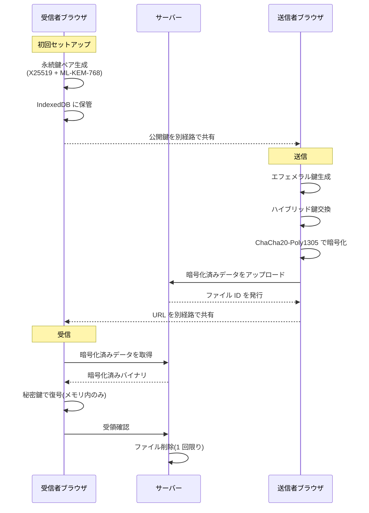

# Personal PQC Drive

ゼロ知識アーキテクチャとハイブリッドポスト量子暗号による、セキュアなファイル受け渡しツール。

## なぜ作ったか

- **クラウドストレージの誤 BAN 対策**: Google Drive 等のコンテンツスキャンによる誤検知・アカウント凍結から逃れるため、サーバーがファイルの中身を一切知り得ない設計にする
- **HNDL 攻撃への備え**: 「Harvest Now, Decrypt Later(今盗んで後で復号)」— 現在の暗号通信を記録しておき、将来の量子コンピュータで復号する攻撃に対し、最初からポスト量子暗号で防御する
- **個人で完結する検閲フリーな受け渡し**: アカウント登録不要、サーバーは暗号化済みバイナリの一時保管と配信のみ

個人プロジェクトであり、「作ってみた」報告(ブログ・GitHub 公開)を目的としている。商用利用や機密データの本番運用は想定していない。

## 主な特徴

- **ハイブリッド PQC 鍵交換**: X25519(古典楕円曲線)+ ML-KEM-768(NIST FIPS 203)。どちらか片方が破られても安全
- **AEAD 暗号化**: ChaCha20-Poly1305 による認証付き暗号
- **受信者公開鍵方式**: URL に鍵を埋め込まない。URL を傍受されても受信者の秘密鍵がなければ復号不可
- **1 回限りの受け渡し**: 受信成功時にサーバー側のファイルを即削除(プライマリ削除)
- **フォールバック削除**: 24 時間で期限切れ。次のアクセス時にスイープ(cron 不要)
- **完全なクライアントサイド暗号化**: 暗号化・復号はすべてブラウザ内。鍵も平文もサーバーに渡らない
- **TypeScript + Vite フロントエンド / PHP バックエンド**(DB 不要、ファイルシステムベース)

## アーキテクチャ



詳細は [docs/architecture.md](docs/architecture.md) を参照。

## 暗号化仕様

受信者は X25519 と ML-KEM-768 の永続鍵ペアを持つ。送信者はエフェメラル X25519 鍵を生成し、`HKDF-SHA256(X25519共有秘密 ‖ ML-KEM共有秘密)` でハイブリッド共有秘密を導出する。そこからファイル鍵とメタデータ鍵を `info` パラメータで分離して派生し、ChaCha20-Poly1305 で暗号化する。ファイルフォーマットはバージョンとアルゴリズム ID を持ち、将来の暗号アジリティに対応する。

詳細は [docs/crypto-spec.md](docs/crypto-spec.md) を参照。

## 脅威モデル

**防御対象**: サーバー運営者による中身の閲覧、サーバー側の自動コンテンツスキャン、サーバー侵害時のデータ流出、通信経路上の盗聴(HTTPS 前提)、将来の量子コンピュータによる収穫攻撃(HNDL)。URL を傍受されただけでは復号できない。

**防御対象外**: エンドポイント侵害(マルウェア・ブラウザ脆弱性)、受信者の悪意による二次漏洩、秘密鍵の物理的・社会的奪取、メタデータ(サイズ・時刻・IP)の推測、秘密鍵を喪失した場合の復元。

詳細は [docs/threat-model.md](docs/threat-model.md) を参照。

## セットアップ

### ローカル開発

```bash
git clone https://github.com/anthamayfair11/personal-pqc-drive.git
cd personal-pqc-drive/frontend
npm install
npm run dev
```

### 本番デプロイ

ビルド成果物(`frontend/dist/` の中身)と PHP バックエンド(`backend/`)、保管領域(`storage/`)を配置する。詳細は [docs/deployment.md](docs/deployment.md) を参照。

## 技術スタック

- **フロントエンド**: TypeScript, Vite
- **暗号化**: [@noble/post-quantum](https://github.com/paulmillr/noble-post-quantum)(ML-KEM-768)、[@noble/curves](https://github.com/paulmillr/noble-curves)(X25519)、[@noble/ciphers](https://github.com/paulmillr/noble-ciphers)(ChaCha20-Poly1305)、[@noble/hashes](https://github.com/paulmillr/noble-hashes)(HKDF-SHA256)。すべて純 JS 実装・依存ゼロ・監査済み
- **バックエンド**: PHP 8.x(外部ライブラリ不要)
- **ストレージ**: ファイルシステム(データベース不要)

## ライセンス

MIT License。[LICENSE](LICENSE) を参照。

## 作者

せっちー

- GitHub: https://github.com/anthamayfair11
- Blog: https://calpissoda.minibird.jp/tsuzuri/
- X: https://x.com/SEGA_10
