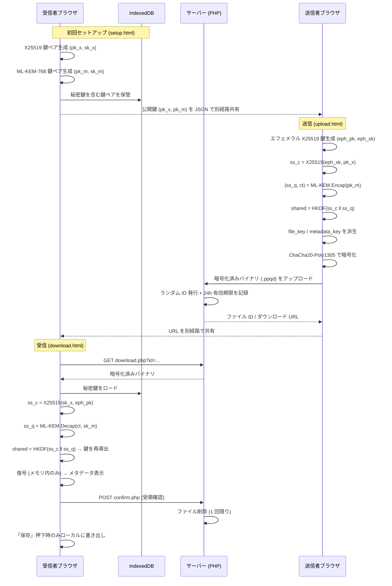
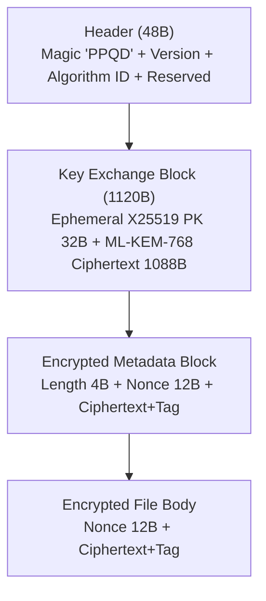

# アーキテクチャ

Personal PQC Drive の全体構成と、主要な設計判断の根拠。

## 全体フロー

このアプリは**受信者公開鍵方式**を採る。受信者が事前に永続鍵ペアを生成し、公開鍵を送信者へ別経路で渡す。送信者はその公開鍵でファイルを暗号化する。URL には鍵を埋め込まない。

## ゼロ知識性

暗号化と復号は**ブラウザ内でのみ**実行され、サーバーには暗号化済みバイナリのみが渡る。鍵もファイル平文もサーバーを通らない。したがって、サーバー運営者・自動スキャン・サーバー侵害のいずれも、ファイルの中身に到達できない。サーバーの役割は「暗号化済みバイナリの一時保管と配信」だけである。

## 公開鍵方式 vs URL 鍵埋め込み方式

| | URL 鍵埋め込み方式 | 受信者公開鍵方式(採用) |
|---|---|---|
| 実装の容易さ | 容易 | やや複雑(受信者の初回鍵生成が必要) |
| URL 傍受時 | **復号可能**(URL に鍵がある) | 復号不可(秘密鍵は IndexedDB のみ) |
| HNDL 耐性 | 弱い(URL を記録されると将来復号される) | 強い |
| Forward Secrecy | なし | あり(送信側エフェメラル鍵) |

### なぜ公開鍵方式を選んだか

URL に鍵を埋め込む方式は実装が楽だが、URL を共有する経路(メール・メッセンジャー等)が傍受されると復号できてしまう。これは「将来 PQC 対応予定」と同じく HNDL 攻撃に無防備である。

公開鍵方式では URL には単なるファイル ID しか含まれず、復号には受信者の秘密鍵(IndexedDB に保管)が必須となる。受信者の初回鍵生成という UX コストを払う代わりに、思想として一貫した検閲フリー + HNDL 耐性を実現する。加えて、送信側のエフェメラル鍵により Forward Secrecy(将来送信者環境が漏れても過去送信は安全)を確保する。

## なぜプレビュー機能を実装しないか

当初はインラインプレビュー(画像・PDF・動画・テキスト)を検討したが、思想と整合しないため実装しない。

プレビューはブラウザのレンダリングエンジン(画像デコーダ・PDF ビューア・動画プレイヤー)に復号データを渡す行為であり、その後の挙動が制御不能領域に入る:

- OS やブラウザによるサムネイルキャッシュのディスク書き込み
- 動画・PDF のメモリスワップによる間接的なディスク残留
- 拡張機能やスクリーンショット系ツールへの露出
- 右クリック「画像を保存」等の能動操作による意図しない保存
- SVG プレビュー実装に伴う XSS 攻撃面

これらは「デフォルトは保存しない、ユーザーが選んだら保存できる」という基本思想に反する。代わりに、復号後はメタデータ(元ファイル名・サイズ・MIME・送信時刻)のみ表示し、「保存」ボタンで通常ファイルとして書き出させる。中身の確認はユーザーが使い慣れたアプリケーションで行う前提とする。

## なぜ「ダウンロード時削除」モデルか

受け渡しは原則 1 回限りとし、受信者が復号に成功した時点でサーバー上のファイルを削除する。これにより、URL が後から第三者に渡っても二度目のダウンロードはできず、サーバーに残るデータ量も最小に保たれる(mixhost の規約は大量・長期保管を想定していない)。

## 自動削除の仕組み(cron 不使用)

ハイブリッド方式を採る:

- **プライマリ削除(`confirm.php`)**: 受信者が URL 経由で復号に成功した直後、ブラウザがバックグラウンドで受領確認 POST を送る。サーバーは該当ファイルを即削除する。冪等(削除済みでも 200)
- **フォールバック削除(`sweep.php`)**: `upload.php` / `download.php` へのアクセスごとに、期限切れ(24h 超)・孤児・壊れたファイルをスイープする。`flock` で多重起動を防ぐ。アクセス駆動なので cron が不要

ローカル D&D で持ち込まれた `.ppqd` の復号では受領確認を送らない(サーバー上に存在しないため)。

> アクセスが全く無いサイトでは sweep が走らないため期限切れファイルが残り得る。実運用では誰かがアップロード/ダウンロードするたびに掃除されるため通常は問題にならない。

## なぜ Vite + TypeScript + PHP か

- **TypeScript**: 暗号処理は型のミスが致命的(`Uint8Array` と `string` の混同など)。暗号フォーマットの構造定義に型システムが役立つ
- **Vite**: 高速なビルドとマルチページ構成(setup / upload / download)への対応。`@noble/*` の ESM をそのままバンドルできる
- **PHP**: バックエンドの役割が「ファイルを受け取って保存・配信」だけなので PHP で十分。mixhost 環境でネイティブに動き、追加のサーバー設定が不要。外部ライブラリ(Composer)も不要

## 鍵管理の方針

- **受信者の永続鍵ペア**: 初回生成時に IndexedDB へ保管。`Uint8Array` と `Date` は構造化クローンでそのまま保存・復元できるため Base64 変換は不要(公開鍵エクスポート時のみ Base64 化)。エクスポート機能で JSON バックアップが可能
- **送信者のエフェメラル鍵**: 送信のたびに新規生成し、送信後は破棄。これにより Forward Secrecy を確保
- **ファイル鍵・メタデータ鍵**: ハイブリッド共有秘密から HKDF の `info` パラメータで分離して派生。サーバーには送らない
- **パスフレーズ保護**: 現フェーズでは未実装(IndexedDB に平文保管)。脅威モデル上「IndexedDB へのアクセス」は防御対象外。将来フェーズでパスフレーズ暗号化を検討

## ファイルフォーマット概要

各フィールドのバイト数の根拠や暗号アジリティの詳細は [crypto-spec.md](crypto-spec.md) を参照。
